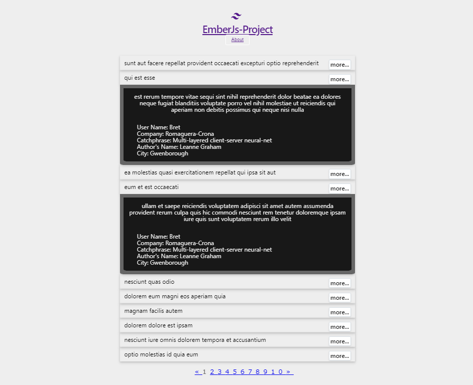
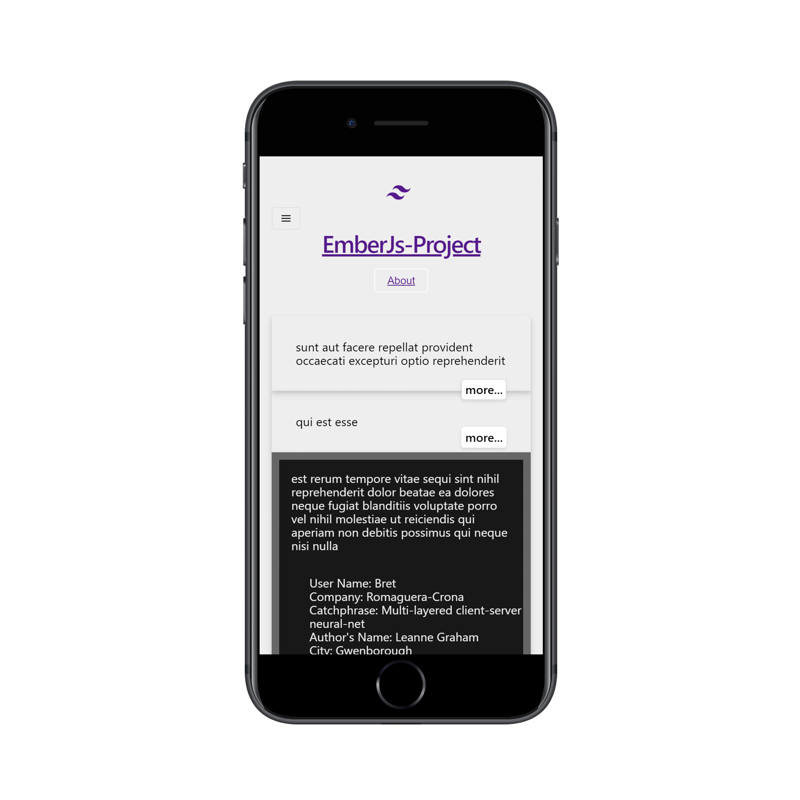

# Ember-js-project

I developed this SPA using the Ember.js Framework that request and shows data from the [JSONPlaceholder API](https://jsonplaceholder.typicode.com/). I am submitting this for your consideration.

## Table of Contents

- [Ember-js-project](#Ember-js-project)
  - [Table of Contents](#Table-of-Contents)
  - [Requirements](#Requirements)
    - [Screenshot](#Screenshot)
  - [Technology](#Technology)
  - [Prerequisites](#Prerequisites)
  - [Installation](#Installation)
  - [Running / Development](#Running--Development)
    - [Code Generators](#Code-Generators)
    - [Running Tests](#Running-Tests)
    - [Linting](#Linting)
    - [Building](#Building)
    - [Deploying](#Deploying)
  - [Contact / Social Media](#Contact--Social-Media)

## Requirements

- Display a paginated list of post titles. The data should be retrieved from the JSONPlaceholder API, and there should be pagination controls to retrieve additional pages of data.
- Each post should be able to toggle a side sliding panel/modal that is populated with the rest of that post's data. You should also include the data of the user related to that post. Make this look & behave however you want, but it should not trigger a full route transition.
- We are not providing a mock for this, you will need to figure out a design that you feel represents the best user experience.
- Do not use a front end framework such as bootstrap, but it's fine to use a utility framework like tailwind or neat.
-The UI should be fairly responsive.
- Write tests that prove your functionality works.

### Screenshot

Neighborhood Map - Screenshot

Neighborhood Map - Mobile

## Technology

- Ember.js
- Ember.js Addons
    - [ember-decorators](https://github.com/ember-decorators/ember-decorators)
    - [babel-eslint](https://github.com/babel/babel-eslint)
    - [ember-cli-pagination](https://github.com/mharris717/ember-cli-pagination)
    - [Ember CSS Transitions](https://github.com/peec/ember-css-transitions)
    - [Autoprefixer for Ember CLI](https://github.com/kimroen/ember-cli-autoprefixer)
    - [Tailwind CSS](https://tailwindcss.com/)
- JavaScript
  - ES6
- Node.js
  - npm
- [JSONPlaceholder API](https://jsonplaceholder.typicode.com/)

## Prerequisites

You will need the following things properly installed on your computer.

* [Git](https://git-scm.com/)
* [Node.js](https://nodejs.org/) (with npm)
* [Ember CLI](https://ember-cli.com/)
* [Google Chrome](https://google.com/chrome/)

## Installation

* `git clone <repository-url>` this repository
* `cd ember-js-project`
* `npm install`

## Running / Development

* `ember serve`
* Visit your app at [http://localhost:4200](http://localhost:4200).
* Visit your tests at [http://localhost:4200/tests](http://localhost:4200/tests).

### Code Generators

Make use of the many generators for code, try `ember help generate` for more details

### Running Tests

* `ember test`
* `ember test --server`

### Linting

* `npm run lint:hbs`
* `npm run lint:js`
* `npm run lint:js -- --fix`

### Building

* `ember build` (development)
* `ember build --environment production` (production)

### Deploying

`npm run build` creates a `build` directory with a production build of your app. Set up your favorite  HTTP server so that a visitor to your site is served the `index.html`.

## Contact / Social Media

- Twitter – [@seetechnologic](https://twitter.com/seetechnologic)
- GitHub - [https://github.com/JavaVista/](https://github.com/JavaVista/)
- LinkedIn - [Javier Carrion](https://www.linkedin.com/in/technologic)
